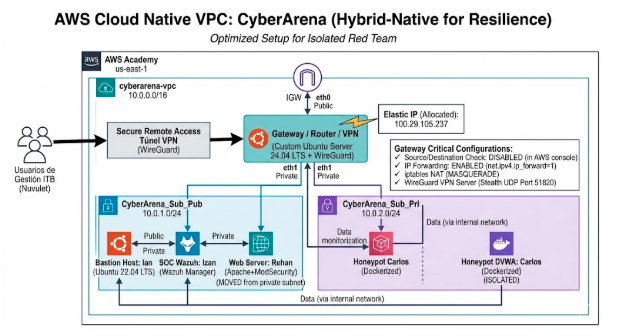

# 🏗️ Arquitectura Técnica - CyberArena

Este documento detalla la infraestructura de red y seguridad desplegada en AWS Cloud para el proyecto CyberArena. El diseño se basa en una arquitectura de **Defensa en Profundidad** y **Zero-Trust**, optimizada para la resiliencia y la monitorización avanzada.

---

## 🖼️ Diagrama de la Arquitectura

---

## 🌐 Diseño de Red y Segmentación (VPC)

La infraestructura reside en una **VPC personalizada (10.0.0.0/16)** segmentada para aislar los activos críticos:

* **Subred Pública - DMZ (10.0.1.0/24):** Zona expuesta donde residen los puntos de entrada y servicios de producción.
* **Subred Privada - El Búnker (10.0.2.0/24):** Zona estanca sin salida directa a Internet, reservada exclusivamente para el **Honeypot (Carlos)**.

---

## 🛡️ Gateway Perimetral: El Corazón del Proyecto

Debido a las restricciones de AWS Academy, se descartó el uso de appliances comerciales (pfSense) en favor de una solución **Cloud-Native a medida**:

* **Instancia:** Ubuntu Server 24.04 LTS actuando como **NAT Gateway y VPN Server**.
* **Interfaces:** Doble interfaz de red (eth0 Pública / eth1 Privada).
* **Elastic IP:** Asociada a la interfaz pública para garantizar un punto de acceso persistente (`100.29.105.237`).
* **Configuración Crítica:**
    * **Source/Destination Check:** Deshabilitado en la consola de AWS para permitir el enrutamiento de paquetes de terceros.
    * **IP Forwarding:** Habilitado en el kernel de Linux (`net.ipv4.ip_forward=1`).
    * **NAT Masquerade:** Implementado mediante `iptables` (`POSTROUTING -s 10.0.2.0/24 -j MASQUERADE`) para dar salida controlada a la subred privada.

---

## 👥 Nodos y Roles Técnicos

### 1. Gestión y Bastión (Ian)
Instancia Ubuntu 22.04 en la subred pública que actúa como punto de salto seguro y administración de la infraestructura.

### 2. Producción y WAF (Rehan)
Servidor Apache2 endurecido con **ModSecurity WAF**. Filtra activamente ataques como SQL Injection y XSS, resolviendo mediante DNS dinámico.

### 3. SOC & SIEM (Izan)
Servidor central de **Wazuh (Manager)**. Recolecta telemetría de todos los nodos mediante agentes internos, proporcionando visibilidad total del tráfico malicioso.

### 4. Honeypot Aislado (Carlos)
Entorno de **Docker Lab** en la subred privada. Ejecuta DVWA y Juice Shop. Es el único componente sin IP pública, lo que garantiza que cualquier ataque sea detectado y contenido dentro de la red privada sin exponer el activo directamente a Internet.

---

## 🔒 Conectividad Segura (WireGuard VPN)

El acceso administrativo se realiza mediante un túnel **WireGuard** cifrado:
* **Puerto:** UDP 51820.
* **Tecnología Stealth:** El puerto permanece "invisible" ante escaneos no autorizados, respondiendo únicamente a clientes con la clave criptográfica correcta.
* **Enrutamiento Interno:** Permite a los analistas acceder a los paneles internos (Wazuh) y a los laboratorios privados como si estuvieran físicamente en la red.

---

## 🧠 Resiliencia Técnica
El proyecto destaca por su capacidad de adaptación. Ante el bloqueo inicial de protocolos en la red local y las limitaciones de AWS Academy con el Marketplace, la arquitectura pivotó exitosamente hacia soluciones personalizadas mediante Linux puro (iptables), túneles SSH dinámicos y redirección de puertos, asegurando la operatividad total del entorno.
