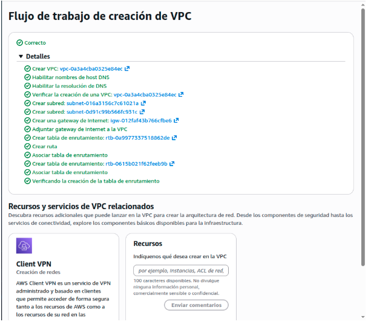
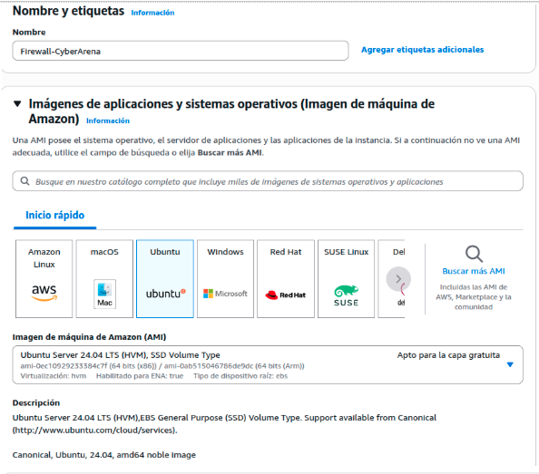
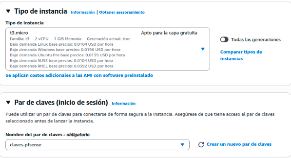
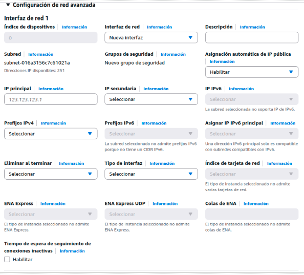
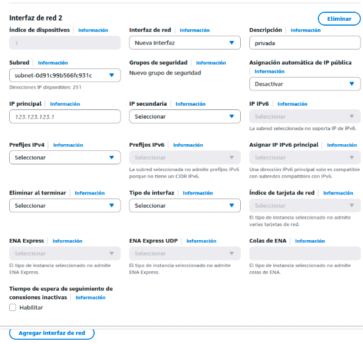
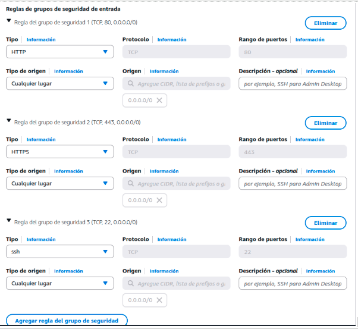
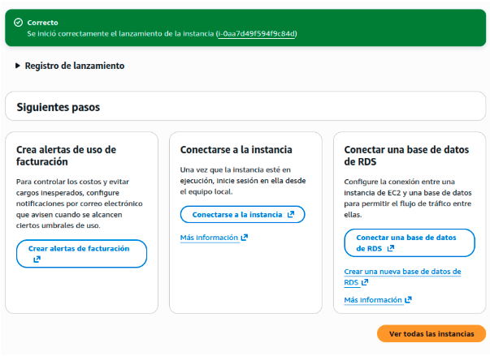

# 🏗️ Sprint 1: Arquitectura Base y Despliegue en AWS Cloud
**Autor:** Ian Frías - Arquitecto de Sistemas

El objetivo principal de este primer Sprint fue establecer los cimientos de la infraestructura **CyberArena** en AWS, garantizando una segmentación lógica de la red para aplicar el principio de Defensa en Profundidad.

---

## 📌 Índice
1. [🛠️ Diseño de la Red (VPC y Subredes)](#diseño-de-la-red)
2. [🚀 Despliegue del Nodo Perimetral (Gateway)](#despliegue-del-nodo)
    * [Configuración de Interfaces y Seguridad](#configuración-interfaces)

---

## 🛠️ Diseño de la Red (VPC y Subredes)
Se diseñó una **Virtual Private Cloud (VPC)** personalizada (`10.0.0.0/16`) para tener control total sobre el enrutamiento y aislar los entornos.

*Creación exitosa de la VPC y sus subredes en la consola de AWS.*

* **Subred Pública - DMZ (`10.0.1.0/24`):** Diseñada para albergar el Firewall Perimetral y exponer servicios hacia Internet.
* **Subred Privada - Búnker (`10.0.2.0/24`):** Diseñada para albergar el Honeypot (Docker Lab) de forma aislada, sin exposición a IPs públicas.

---

## 🚀 Despliegue del Nodo Perimetral (Gateway)
Ante las restricciones de AWS Academy para usar appliances del Marketplace (como pfSense preconfigurado), pivotamos hacia la creación de un router personalizado usando **Ubuntu Server 24.04 LTS (t3.micro)**.

*Selección de la imagen base de Ubuntu y configuración de claves RSA para acceso seguro.*

### Configuración de Interfaces y Seguridad
Para que el servidor actúe como puente entre Internet y el Honeypot, se le configuraron dos interfaces de red (ENI) y un grupo de seguridad estricto.

* **eth0 (Pública):** Conectada a la subred `10.0.1.0/24`.
* **eth1 (Privada):** Conectada a la subred `10.0.2.0/24` (Interfaz 2 configurada manualmente).

*Asignación de las interfaces a sus respectivas subredes.*

Se creó el **Security Group (`pfSense-SG`)** aplicando el principio de mínimo privilegio, permitiendo únicamente el tráfico web estándar y la administración cifrada:
* HTTP (80)
* HTTPS (443)
* SSH (22)

Una vez configurado el almacenamiento y la red, el nodo perimetral fue lanzado con éxito en la infraestructura.

