# Documentación Técnica – Infraestructura Cloud del Proyecto Final
 
> **Proyecto:** CyberArena – Plataforma de Ciberseguridad  
> **Proveedor Cloud:** Amazon Web Services (AWS)  
> **Sistema Operativo:** Ubuntu 24.04 LTS  
> **Fecha de despliegue:** Mayo 2026
 
---
 
## Índice
 
1. [Resumen de la Instancia AWS (EC2)](#1-resumen-de-la-instancia-aws-ec2)
2. [Configuración de Seguridad (Firewall)](#2-configuración-de-seguridad-firewall)
3. [Conexión Remota vía SSH](#3-conexión-remota-vía-ssh)
4. [Instalación del Servidor Web Nginx](#4-instalación-del-servidor-web-nginx)
5. [Instalación de MariaDB](#5-instalación-de-mariadb)
6. [Configuración de PHP y Extensiones](#6-configuración-de-php-y-extensiones)
7. [Securización de la Base de Datos](#7-securización-de-la-base-de-datos)
8. [Gestión de Usuarios y Permisos SQL](#8-gestión-de-usuarios-y-permisos-sql)
9. [Estructura de Tablas (Logs)](#9-estructura-de-tablas-logs)
10. [Despliegue del Código Fuente](#10-despliegue-del-código-fuente)
11. [Configuración de Dominio Dinámico (DuckDNS)](#11-configuración-de-dominio-dinámico-duckdns)
12. [Instalación de Certbot para HTTPS](#12-instalación-de-certbot-para-https)
13. [Obtención y Despliegue del Certificado SSL](#13-obtención-y-despliegue-del-certificado-ssl)
14. [Configuración del Virtual Host en Nginx](#14-configuración-del-virtual-host-en-nginx)
15. [Dashboard de Control "CyberArena"](#15-dashboard-de-control-cyberarena)
16. [Estructura Final de la Base de Datos](#16-estructura-final-de-la-base-de-datos)
17. [17. Incidencias y Problemas Encontrados](#17-incidencias-y-problemas-encontrados)
---
 
## 1. Resumen de la Instancia AWS (EC2)
 
Se ha desplegado una instancia **t3.micro** en la región de AWS correspondiente, ejecutando **Ubuntu 24.04 LTS** como sistema operativo base. La instancia se encuentra en estado **"En ejecución"** (*Running*), con una IP pública asignada que permite la conectividad entrante desde Internet.
 
**Especificaciones de la instancia:**
 
| Parámetro | Valor |
|---|---|
| Tipo de instancia | `t3.micro` |
| Sistema operativo | Ubuntu 24.04 LTS |
| Estado | En ejecución ✅ |
| Arquitectura | x86_64 |
| Almacenamiento | EBS (Elastic Block Store) |
 
> La elección de `t3.micro` responde a los requisitos del proyecto: suficiente capacidad de cómputo para un entorno de pruebas y producción ligera, con elegibilidad dentro del nivel gratuito de AWS.
 
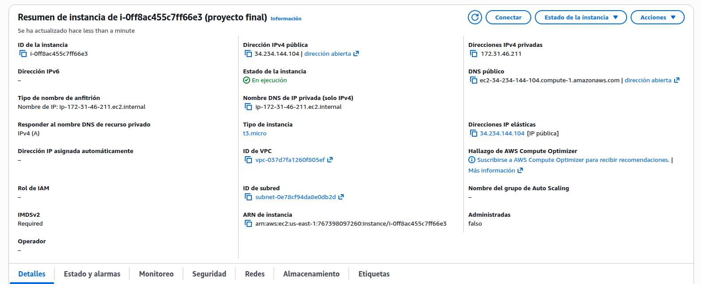
 
---
 
## 2. Configuración de Seguridad (Firewall)

Se han definido las reglas del **Security Group** asociado a la instancia EC2. Este actúa como firewall virtual a nivel de red, controlando el tráfico de entrada (inbound) y salida (outbound) de la instancia.

### Análisis de la configuración según captura

Basado en la configuración visualizada en el panel de AWS, se destacan los siguientes puntos:

* **Segmentación de Base de Datos:** El tráfico hacia el puerto **3306 (MySQL)** está restringido al bloque CIDR `10.0.0.0/16`, lo que garantiza que solo otros recursos dentro de la misma red privada puedan conectarse a la base de datos, siguiendo las mejores prácticas de seguridad.
* **Diagnóstico Interno:** Se permite el protocolo **ICMP** únicamente desde la red interna (`10.0.0.0/16`), facilitando tareas de red (como `ping`) sin exponer el servidor a escaneos externos.
* **Servicios Web Ampliados:** Además de los puertos estándar **80** y **443**, se ha habilitado el puerto **8080**, comúnmente utilizado para entornos de desarrollo o servidores de aplicaciones específicos.
* **Acceso Global:** El servicio **SSH (puerto 22)** y los servicios web están configurados con origen `0.0.0.0/0` para permitir el acceso desde cualquier ubicación.
 
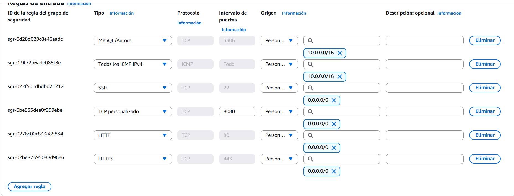
 
---
 
## 3. Conexión Remota vía SSH
 
El acceso al servidor se realiza desde el terminal local mediante el protocolo **SSH**, autenticando con la llave privada `.pem` generada en el momento de crear la instancia en AWS.
 
**Procedimiento de conexión:**
 
```bash
# Asignar permisos correctos a la clave privada
chmod 400 clave-proyecto.pem
 
# Conectar al servidor como usuario ubuntu
ssh -i "clave-proyecto.pem" ubuntu@<IP_PUBLICA>
```
 
> El uso de autenticación por clave pública/privada (PKI) es más seguro que la autenticación por contraseña, ya que elimina el riesgo de ataques de fuerza bruta sobre credenciales.
 
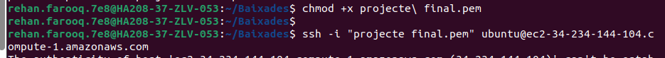
 
---
 
## 4. Instalación del Servidor Web Nginx
 
Se ha instalado **Nginx** como servidor web principal. Nginx actúa como reverse proxy y servidor de contenido estático, procesando las peticiones HTTP/HTTPS entrantes y redirigiéndolas al intérprete PHP.
 
```bash
sudo apt update && sudo apt upgrade -y
sudo apt install -y nginx
sudo systemctl enable nginx
sudo systemctl start nginx
```
 
**Ventajas de Nginx frente a Apache en este contexto:**
- Menor consumo de memoria en instancias de recursos limitados (`t3.micro`)
- Mejor rendimiento bajo carga concurrente mediante arquitectura basada en eventos
- Integración nativa con Certbot para la gestión de certificados SSL
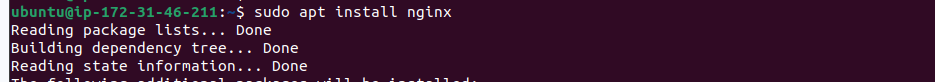
 
---
 
## 5. Instalación de MariaDB
 
Se ha desplegado **MariaDB Server** como motor de base de datos relacional. MariaDB es un fork comunitario de MySQL que ofrece plena compatibilidad con las instrucciones SQL estándar y mejoras de rendimiento adicionales.
 
```bash
sudo apt install -y mariadb-server
sudo systemctl enable mariadb
sudo systemctl start mariadb
```
 
El sistema descargó y preparó los paquetes correctamente desde los repositorios oficiales de Ubuntu Noble (24.04), confirmando la integridad de la instalación.
 
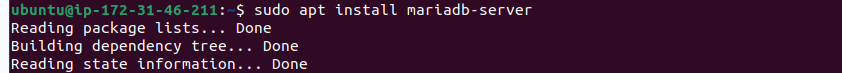
 
---
 
## 6. Configuración de PHP y Extensiones
 
Se ha instalado el intérprete **PHP** junto con las extensiones necesarias para la integración con Nginx y MariaDB:
 
```bash
sudo apt install -y php-fpm php-mysql php-cli php-curl php-json
```
 
**Extensiones instaladas y su función:**
 
| Extensión | Función |
|---|---|
| `php-fpm` | FastCGI Process Manager – interfaz entre Nginx y PHP |
| `php-mysql` | Conector PHP ↔ MariaDB/MySQL |
| `php-cli` | Ejecución de scripts PHP desde línea de comandos |
| `php-curl` | Soporte para peticiones HTTP externas desde PHP |
| `php-json` | Manejo nativo de estructuras JSON |
 
> La comunicación entre Nginx y PHP se realiza a través de un socket Unix (`php-fpm`), lo que mejora el rendimiento respecto al uso de sockets TCP.
 
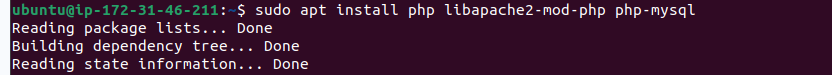
 
---
 
## 7. Securización de la Base de Datos
 
Se ejecutó el script de seguridad `mysql_secure_installation` para endurecer la instalación por defecto de MariaDB, eliminando configuraciones inseguras que vienen habilitadas de serie.
 
```bash
sudo mysql_secure_installation
```
 
**Acciones realizadas durante el proceso:**
 
| Acción | Resultado |
|---|---|
| Definir contraseña para usuario `root` | ✅ Configurado |
| Eliminar usuarios anónimos | ✅ Eliminados |
| Deshabilitar login root remoto | ✅ Deshabilitado |
| Eliminar base de datos de prueba (`test`) | ✅ Eliminada |
| Recargar tabla de privilegios | ✅ Aplicado |
 
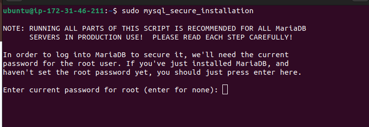
 
---
 
## 8. Gestión de Usuarios y Permisos SQL
 
Se creó la base de datos del proyecto y un usuario dedicado con privilegios mínimos necesarios, siguiendo el principio de **mínimo privilegio** (*least privilege*).
 
```sql
-- Crear la base de datos del proyecto
CREATE DATABASE arena_db CHARACTER SET utf8mb4 COLLATE utf8mb4_unicode_ci;
 
-- Crear usuario dedicado para la aplicación
CREATE USER 'arena_sys'@'localhost' IDENTIFIED BY '<contraseña_segura>';
 
-- Otorgar privilegios únicamente sobre la base de datos del proyecto
GRANT ALL PRIVILEGES ON arena_db.* TO 'arena_sys'@'localhost';
 
-- Aplicar los cambios de privilegios
FLUSH PRIVILEGES;
```
 
> **Buena práctica:** El usuario `arena_sys` tiene acceso exclusivo a `arena_db` y solo puede conectarse desde `localhost`. Nunca se utiliza el usuario `root` desde la aplicación.
 
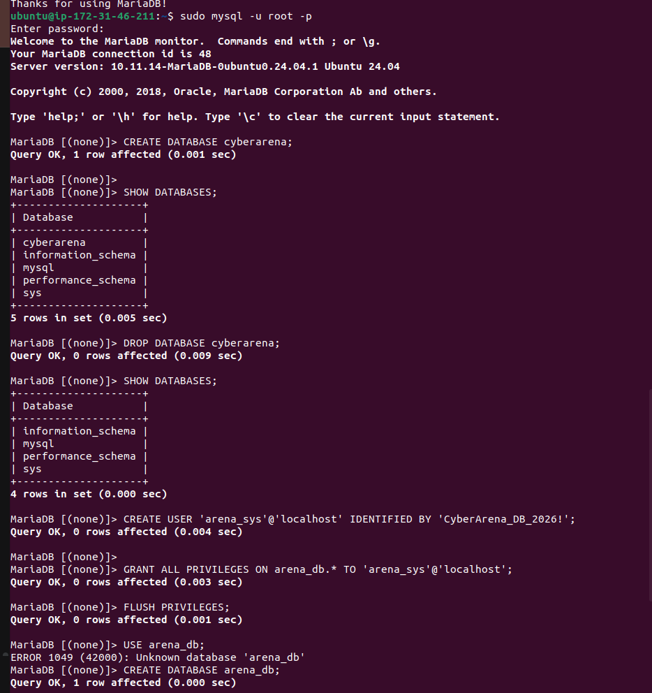
 
---
 
## 9. Estructura de Tablas (Logs)
 
Se definió la tabla `logs_ataques` dentro de `arena_db` para registrar los eventos de seguridad detectados por la plataforma. La estructura incluye los campos esenciales para la trazabilidad de incidentes:
 
```sql
CREATE TABLE logs_ataques (
    id            INT AUTO_INCREMENT PRIMARY KEY,
    origen_ip     VARCHAR(45)  NOT NULL,
    tipo_incidente VARCHAR(100) NOT NULL,
    descripcion   TEXT,
    timestamp     DATETIME DEFAULT CURRENT_TIMESTAMP
);
```
 
**Descripción de los campos:**
 
| Campo | Tipo | Descripción |
|---|---|---|
| `id` | INT AUTO_INCREMENT | Identificador único del registro |
| `origen_ip` | VARCHAR(45) | IP de origen del ataque (soporta IPv4 e IPv6) |
| `tipo_incidente` | VARCHAR(100) | Clasificación del tipo de ataque detectado |
| `descripcion` | TEXT | Detalle adicional del incidente |
| `timestamp` | DATETIME | Marca de tiempo automática del registro |
 
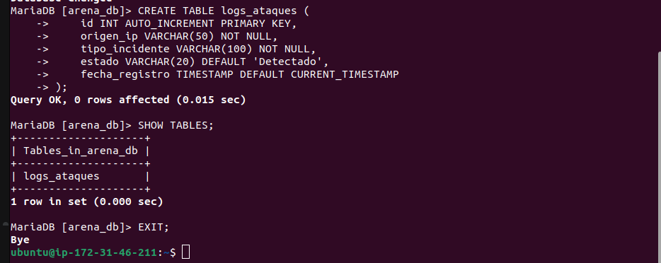
 
---
 
## 10. Despliegue del Código Fuente
 
El código fuente de la aplicación se descargó directamente desde el repositorio Git al directorio raíz del servidor web:
 
```bash
# Clonar el repositorio en el directorio web
sudo git clone <URL_REPOSITORIO> /var/www/html/
 
# Ajustar propietario al usuario del servidor web
sudo chown -R www-data:www-data /var/www/html/
 
# Establecer permisos correctos
sudo chmod -R 755 /var/www/html/
```
 
> La asignación del propietario a `www-data` es fundamental para que el proceso de Nginx pueda leer y servir los archivos de la aplicación sin requerir permisos elevados.
 
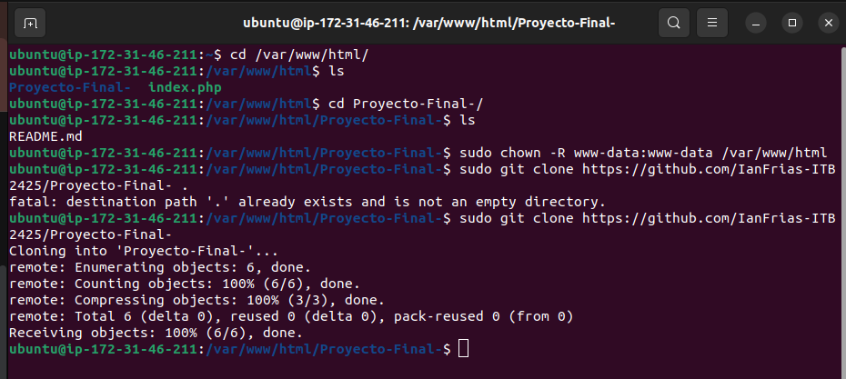
 
---
 
## 11. Configuración de Dominio Dinámico (DuckDNS)
 
Se ha vinculado la IP pública de la instancia EC2 (`34.234.144.104`) con el dominio dinámico `cyberarena-rehan.duckdns.org` a través del servicio **DuckDNS**.
 
**Motivación del uso de DuckDNS:**
- Las IPs públicas de instancias EC2 son dinámicas y pueden cambiar al reiniciar la instancia
- DuckDNS proporciona un FQDN (Fully Qualified Domain Name) estable y gratuito
- Certbot requiere un nombre de dominio válido para emitir el certificado SSL
| Parámetro | Valor |
|---|---|
| Dominio | `cyberarena-rehan.duckdns.org` |
| IP vinculada | `34.234.144.104` |
| Tipo de registro | A (IPv4) |
 
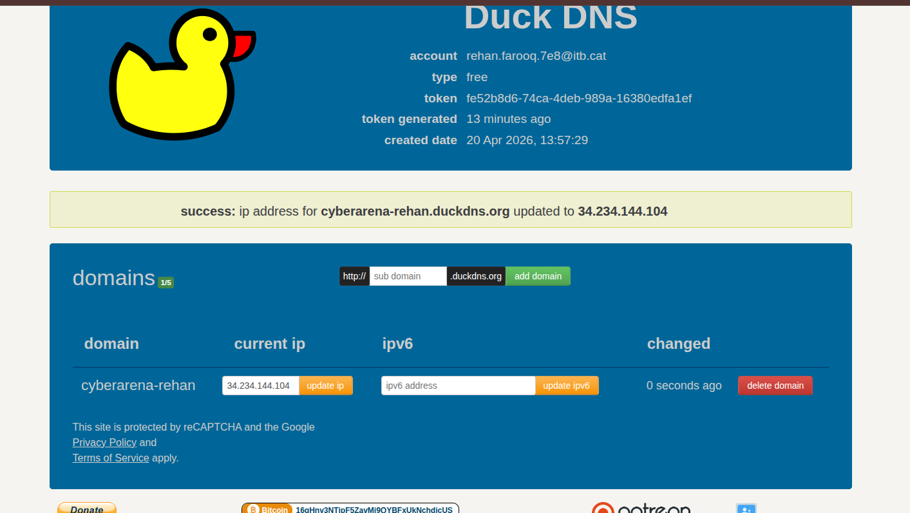
 
---
 
## 12. Instalación de Certbot para HTTPS
 
Se preparó el servidor para la gestión de certificados SSL/TLS mediante **Certbot**, la herramienta oficial de la organización ISRG para trabajar con certificados de **Let's Encrypt**.
 
```bash
sudo apt install -y certbot python3-certbot-nginx
```
 
**Componentes instalados:**
 
| Paquete | Función |
|---|---|
| `certbot` | Cliente ACME para obtención y renovación de certificados |
| `python3-certbot-nginx` | Plugin de integración con Nginx para configuración automática |
 
> Let's Encrypt emite certificados válidos por 90 días. Certbot configura automáticamente una tarea de renovación periódica (`systemd timer`) para mantener el certificado siempre vigente.
 
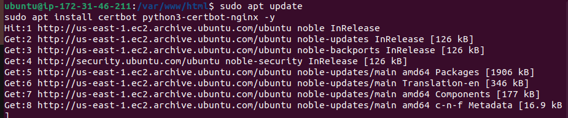
 
---
 
## 13. Obtención y Despliegue del Certificado SSL
 
Se ejecutó Certbot para obtener el certificado SSL gratuito de Let's Encrypt y configurar automáticamente Nginx para servir el tráfico en HTTPS:
 
```bash
sudo certbot --nginx -d cyberarena-rehan.duckdns.org
```
 
**Resultado del proceso:**
- Certbot verificó la propiedad del dominio mediante el desafío ACME HTTP-01
- Obtuvo e instaló el certificado en `/etc/letsencrypt/live/cyberarena-rehan.duckdns.org/`
- Configuró automáticamente Nginx para redirigir todo el tráfico HTTP (puerto 80) a HTTPS (puerto 443)
- Programó la renovación automática del certificado cada 60 días
> El cifrado SSL/TLS garantiza la confidencialidad e integridad de las comunicaciones entre el cliente y el servidor, previniendo ataques de tipo *man-in-the-middle* (MITM).
 
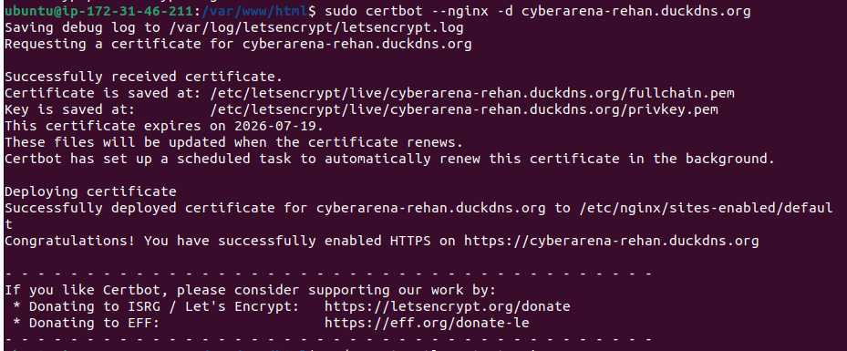
 
---
 
## 14. Configuración del Virtual Host en Nginx
 
Se ajustó el archivo de configuración del virtual host de Nginx para que coincida exactamente con el dominio registrado, garantizando el correcto enrutamiento de las peticiones:
 
```nginx
server {
    listen 443 ssl;
    server_name cyberarena-rehan.duckdns.org;
 
    root /var/www/html;
    index index.php index.html;
 
    # Certificados SSL gestionados por Certbot
    ssl_certificate     /etc/letsencrypt/live/cyberarena-rehan.duckdns.org/fullchain.pem;
    ssl_certificate_key /etc/letsencrypt/live/cyberarena-rehan.duckdns.org/privkey.pem;
 
    location ~ \.php$ {
        include snippets/fastcgi-php.conf;
        fastcgi_pass unix:/run/php/php-fpm.sock;
    }
}
```
 
Tras modificar la configuración, se validó y recargó el servicio:
 
```bash
sudo nginx -t && sudo systemctl reload nginx
```
 

 
---
 
## 15. Dashboard de Control "CyberArena"
 
El panel de control de la plataforma **CyberArena** muestra en tiempo real el estado de los servicios críticos de la infraestructura:
 
| Servicio | Tecnología | Estado |
|---|---|---|
| Web Server | Nginx | 🟢 Nominal |
| Database | MariaDB | 🟢 Nominal |
| SIEM Telemetry | Wazuh Agent | 🟢 Online |
 
El dashboard permite al administrador verificar de forma rápida la disponibilidad de todos los componentes del stack sin necesidad de acceder por SSH al servidor.
 
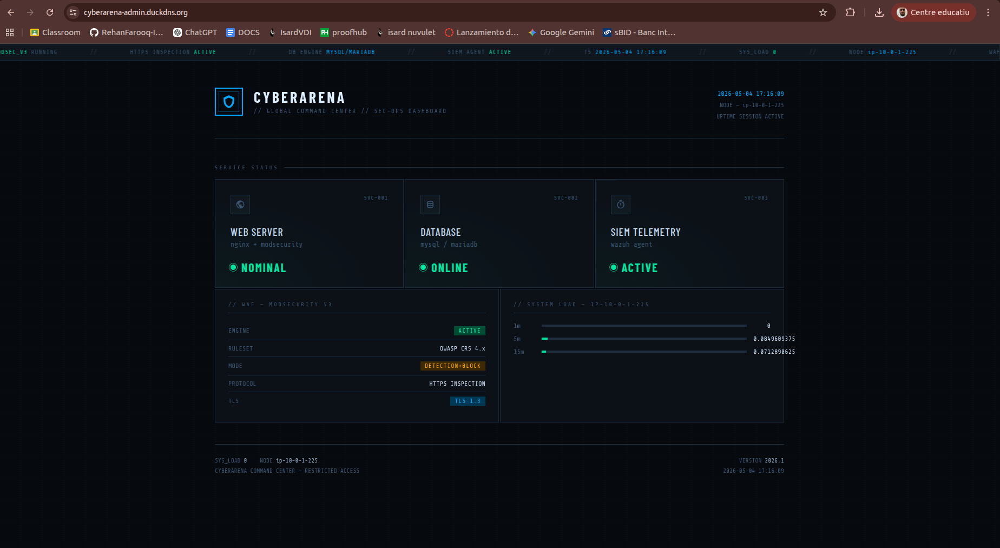
 
---
 
## 16. Estructura Final de la Base de Datos
 
La base de datos `arena_db` quedó completamente operativa con **3 tablas** que soportan la lógica de negocio de la plataforma:
 
**Tabla `usuarios`** – Gestión de accesos a la plataforma:
```sql
CREATE TABLE usuarios (
    id       INT AUTO_INCREMENT PRIMARY KEY,
    nombre   VARCHAR(100) NOT NULL,
    email    VARCHAR(150) UNIQUE NOT NULL,
    password VARCHAR(255) NOT NULL,
    rol      ENUM('admin', 'viewer') DEFAULT 'viewer',
    creado_en DATETIME DEFAULT CURRENT_TIMESTAMP
);
```
 
**Tabla `alertas_reales`** – Registro de alertas con soporte para datos JSON:
```sql
CREATE TABLE alertas_reales (
    id        INT AUTO_INCREMENT PRIMARY KEY,
    tipo      VARCHAR(100) NOT NULL,
    datos_raw JSON,
    procesado TINYINT(1) DEFAULT 0,
    recibido_en DATETIME DEFAULT CURRENT_TIMESTAMP
);
```
 
**Tabla `logs_ataques`** – Eventos de seguridad detectados (ver sección 9).
 
> El uso del tipo de dato `JSON` nativo de MariaDB (a partir de la versión 10.2) permite almacenar y consultar datos semiestructurados directamente desde SQL, ideal para logs de SIEM con esquema variable.
 
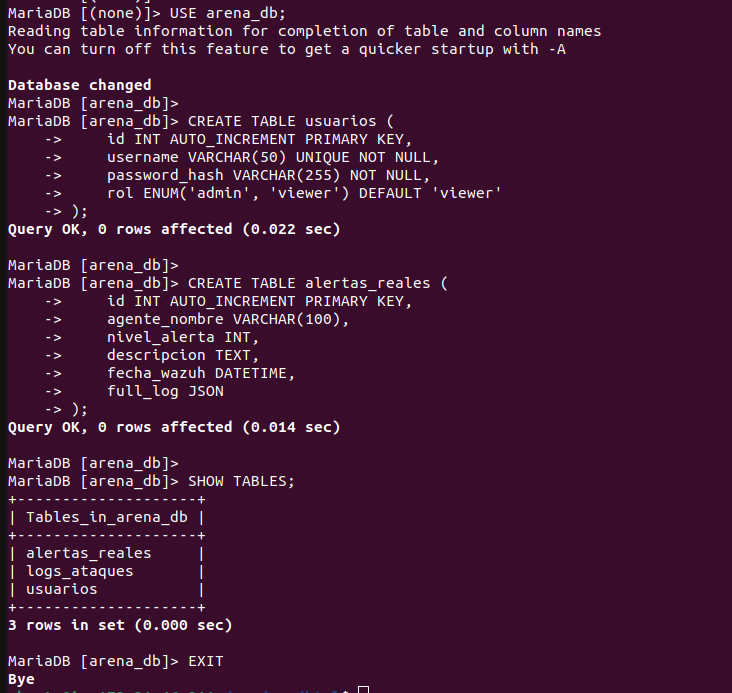
 
---
 

## 17. Incidencias y Problemas Encontrados
 
### Expiración de la suscripción AWS del centro educativo
 
Durante el desarrollo del proyecto, la suscripción de AWS del centro educativo expiró de forma inesperada, lo que provocó la pérdida de acceso a todas las instancias EC2 y la eliminación de los recursos asociados (instancias, volúmenes, Security Groups y configuración de red).
 
Esto obligó al equipo a rehacer desde cero toda la infraestructura del servidor web, repitiendo el proceso de despliegue completo descrito en esta documentación.
 
Gracias a que esta documentación fue redactada de forma detallada durante el Sprint 1, el proceso de reconstrucción fue significativamente más rápido que el despliegue original. Cada paso estaba registrado con los comandos exactos, configuraciones y decisiones tomadas, lo que permitió replicar el entorno sin tener que investigar de nuevo ni improvisar.
 


 
## Resumen del Despliegue
 
La infraestructura cloud del proyecto CyberArena ha quedado completamente operativa. A continuación se presenta el stack tecnológico desplegado y el estado de cada componente:
 
| Capa | Tecnología | Versión | Estado |
|---|---|---|---|
| **Cloud** | Amazon Web Services (EC2) | t3.micro | ✅ |
| **SO** | Ubuntu LTS | 24.04.4 | ✅ |
| **Servidor Web** | Nginx | Latest | ✅ |
| **Base de datos** | MariaDB Server | Latest | ✅ |
| **Lenguaje** | PHP + php-fpm | Latest | ✅ |
| **Certificado SSL** | Let's Encrypt (Certbot) | – | ✅ |
| **DNS dinámico** | DuckDNS | – | ✅ |
| **SIEM** | Wazuh Agent | – | ✅ |
| **Control de versiones** | Git | – | ✅ |
 
**Arquitectura del flujo de petición:**
 
```
Usuario → DNS (DuckDNS) → IP Pública AWS → Security Group (puerto 443)
       → Nginx (SSL/TLS termination) → PHP-FPM → MariaDB (arena_db)
```
 
Todos los servicios están configurados para iniciarse automáticamente con el sistema (`systemctl enable`), garantizando la disponibilidad del servicio tras reinicios de la instancia.
 
---
 

