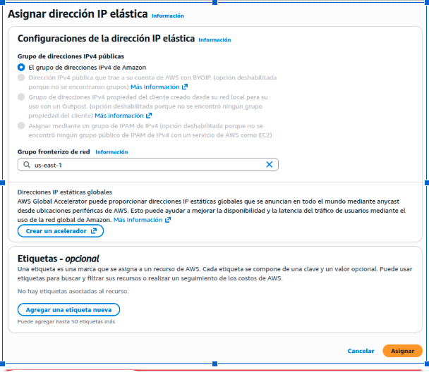
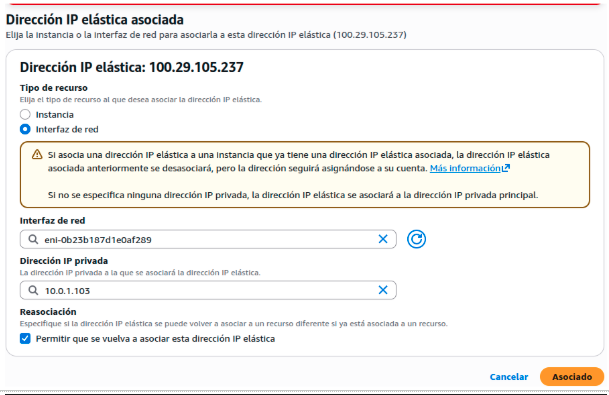
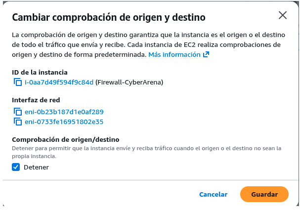
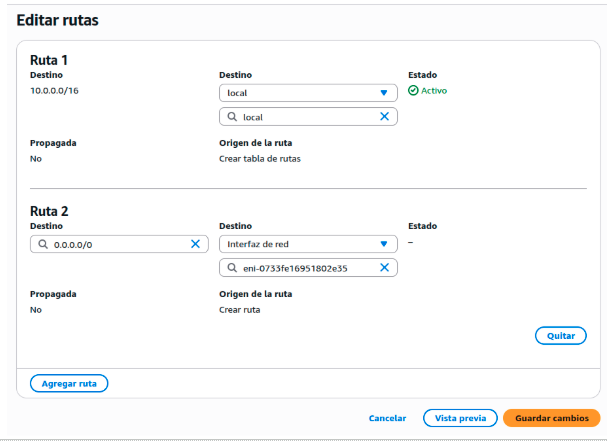
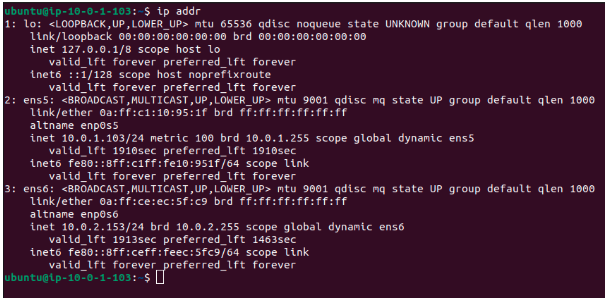
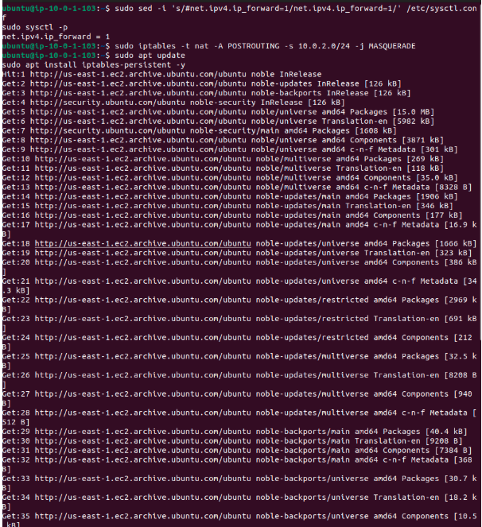
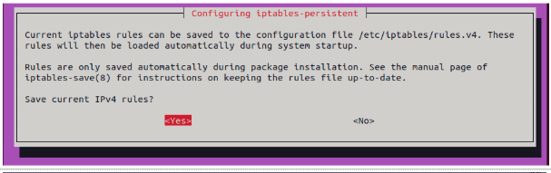
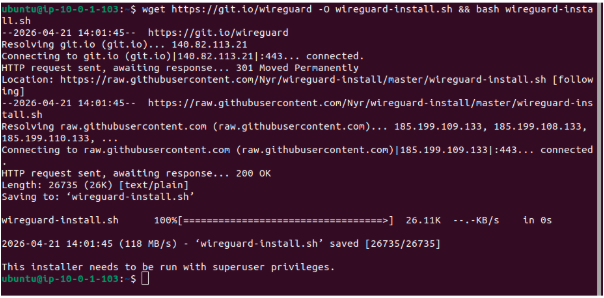
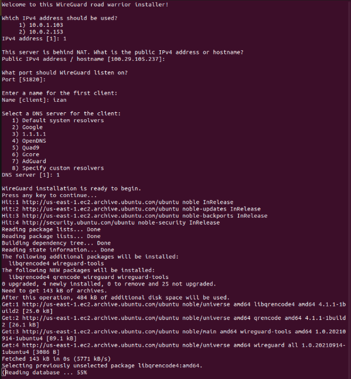
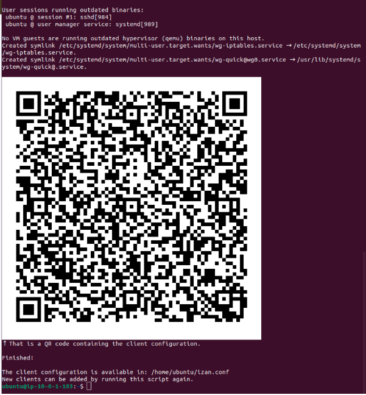

# 🚀 Enrutamiento NAT, Resiliencia y VPN

Con la máquina base desplegada, el reto de estos sprints consistió en transformar el servidor Ubuntu en un **Router Perimetral y Servidor VPN** totalmente funcional, superando las limitaciones nativas de la nube y estableciendo un acceso seguro para el Red Team y el SOC.

---

## 📌 Índice
1. [🌐 Direccionamiento IP y Enrutamiento AWS](#direccionamiento-ip)
2. [🔀 Configuración del NAT (Linux iptables)](#configuracion-nat)
3. [🛡️ Despliegue de la VPN (WireGuard)](#despliegue-vpn)

---

## 🌐 Direccionamiento IP y Enrutamiento AWS
Para garantizar un punto de acceso persistente a la infraestructura, se asignó una **Elastic IP (`100.29.105.237`)** a la interfaz de red principal del Gateway.

**🔥 Paso Crítico de Arquitectura (AWS Routing):**
Para que la instancia pudiera actuar como router (reenviando tráfico que no estaba destinado a su propia IP), fue obligatorio realizar dos configuraciones clave en la consola de AWS:
1. **Deshabilitar "Source/Destination Check"** en la instancia.
2. **Editar la Tabla de Rutas** para que el tráfico interno fluyera correctamente hacia la interfaz privada (`eni-0733fe...`).

---

## 🔀 Configuración del NAT (Linux iptables)
Tras acceder por SSH al servidor, verifiqué el estado de las interfaces de red (`ens5` para la pública, `ens6` para la privada).

Para permitir que la subred privada del Honeypot tuviera salida a Internet (para actualizaciones e instalación de Docker) de forma enmascarada, configuré el núcleo de Linux y el firewall interno:
1. Se habilitó el **IP Forwarding** en `/etc/sysctl.conf`.
2. Se aplicó una regla de NAT (Masquerade) con **iptables**.
3. Se instaló el paquete `iptables-persistent` para hacer las reglas persistentes tras los reinicios.

---

## 🛡️ Despliegue de la VPN (WireGuard)
Para permitir el acceso seguro de los usuarios (SOC y Red Team) a la red privada esquivando los bloqueos de los firewalls corporativos, desplegué **WireGuard VPN**.

Utilizando el puerto **UDP 51820** y la tecnología de cripto-enrutamiento silencioso (Stealth), se instaló y configuró el servidor mediante un script automatizado, generando el primer perfil de cliente (`izan.conf`).

*Creación del cliente VPN y generación del código QR para una fácil importación en dispositivos móviles o de escritorio.*
