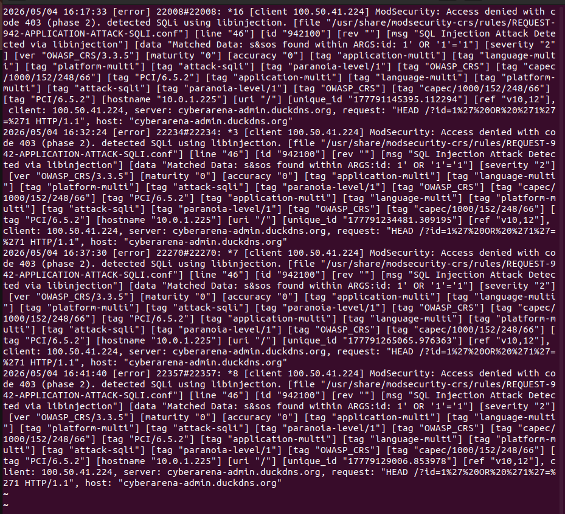

# Documentación de Hardening y Seguridad del Servidor

## Índice

1. [Instalación de ModSecurity con Apache](#1-instalación-de-modsecurity-con-apache)
2. [Activación del Motor de ModSecurity](#2-activación-del-motor-de-modsecurity)
3. [Reinstalación del CRS de ModSecurity](#3-reinstalación-del-crs-de-modsecurity)
4. [Prueba de Funcionamiento – Bloqueo de SQLi](#4-prueba-de-funcionamiento--bloqueo-de-sqli)
5. [Validación de Configuración de Nginx](#5-validación-de-configuración-de-nginx)
6. [Configuración de ModSecurity](#6-configuración-de-modsecurity)
7. [Logs de ModSecurity – Detección de SQLi](#7-logs-de-modsecurity--detección-de-sqli)
8. [Configuración del Agente Wazuh](#8-configuración-del-agente-wazuh)
9. [Auditoría con Lynis (Estado Inicial)](#9-auditoría-con-lynis-estado-inicial)
10. [Configuración SSH – MaxAuthTries](#10-configuración-ssh--maxauthtries)
11. [Configuración SSH – Reenvío TCP y X11](#11-configuración-ssh--reenvío-tcp-y-x11)
12. [Configuración SSH – Logging y Autenticación](#12-configuración-ssh--logging-y-autenticación)
13. [Política de Contraseñas – Caducidad](#13-política-de-contraseñas--caducidad)
14. [Política de Contraseñas – SHA Crypt Rounds](#14-política-de-contraseñas--sha-crypt-rounds)
15. [Parámetros del Kernel – Protección de Red](#15-parámetros-del-kernel--protección-de-red)
16. [Configuración de Fail2Ban para SSH](#16-configuración-de-fail2ban-para-ssh)
17. [Auditoría con Lynis (Estado Final)](#17-auditoría-con-lynis-estado-final)
18. [Securización de MariaDB](#18-securización-de-mariadb)
19. [Script de Backup Automatizado](#19-script-de-backup-automatizado)
20. [Configuración de Cron para Backups Automáticos](#20-configuración-de-cron-para-backups-automáticos)
21. [Ejecución y Verificación del Backup](#21-ejecución-y-verificación-del-backup)
22. [Logs de ModSecurity – Detección de SQLi (08/05/2026)](#22-logs-de-modsecurity--detección-de-sqli-08052026)
23. [Logs de ModSecurity – Detección de XSS (08/05/2026)](#23-logs-de-modsecurity--detección-de-xss-08052026)

---

## 1. Instalación de ModSecurity con Apache

Se ejecutó `sudo apt update` seguido de `sudo apt install -y libapache2-mod-security2` para instalar el módulo ModSecurity en Apache. El sistema descargó e instaló los paquetes necesarios desde los repositorios oficiales de Ubuntu Noble (24.04).


---

## 2. Activación del Motor de ModSecurity

Se realizó la configuración inicial de ModSecurity en Nginx cambiando el modo de detección a modo de bloqueo activo:

```bash
# Copiar configuración recomendada como configuración activa
sudo mv /etc/modsecurity/modsecurity.conf-recommended /etc/modsecurity/modsecurity.conf

# Activar el motor de reglas (DetectionOnly → On)
sudo sed -i 's/SecRuleEngine DetectionOnly/SecRuleEngine On/' /etc/modsecurity/modsecurity.conf
```

Este paso es crítico: sin él, ModSecurity solo **detecta** pero no **bloquea** los ataques.


---

## 3. Reinstalación del CRS de ModSecurity

Se procedió a reinstalar el Core Rule Set (CRS) de ModSecurity para asegurar una instalación limpia:

```bash
sudo rm -rf /usr/share/modsecurity-crs
sudo apt install -y modsecurity-crs
```

La reinstalación confirmó que la versión `3.3.5-2` ya era la más reciente. Se indicó que el paquete `apache2-data` fue instalado automáticamente y puede eliminarse con `sudo apt autoremove`.


---

## 4. Prueba de Funcionamiento – Bloqueo de SQLi

Se realizaron pruebas desde otra máquina (`ip-10-0-1-175`) para verificar el funcionamiento de ModSecurity:

**Petición maliciosa (SQLi):**
```bash
curl -I -k "https://cyberarena-admin.duckdns.org/?id=1%27%20OR%20%271%27=%271"
# Resultado: HTTP/1.1 403 Forbidden ✅ (bloqueada correctamente)
```

**Petición legítima:**
```bash
curl -I -k "https://cyberarena-admin.duckdns.org/"
# Resultado: HTTP/1.1 200 OK ✅ (permitida correctamente)
```

ModSecurity bloquea los ataques sin afectar el tráfico legítimo.


---

## 5. Validación de Configuración de Nginx

Se validó la configuración de Nginx con ModSecurity integrado mediante `sudo nginx -t`:

```
2026/05/04 16:21:44 [notice] ModSecurity-nginx v1.0.3 (rules loaded inline/local/remote: 0/915/0)
nginx: the configuration file /etc/nginx/nginx.conf syntax is ok
nginx: configuration file /etc/nginx/nginx.conf test is successful
```

- **915 reglas** cargadas localmente desde el CRS de OWASP.
- Sintaxis de Nginx correcta y prueba de configuración exitosa.


---

## 6. Configuración de ModSecurity

El archivo `/etc/modsecurity/modsecurity.conf` fue configurado con las siguientes directivas:

```apache
SecRuleEngine On
SecRequestBodyAccess On

# Cargar el cerebro de OWASP
Include /usr/share/modsecurity-crs/crs-setup.conf

# Cargar las reglas de ataque
Include /usr/share/modsecurity-crs/rules/*.conf

# Cargar whitelist personalizada
Include /etc/modsecurity/whitelist.conf
```

Se activó el motor de reglas en modo **On** (bloqueo activo) y se incluyó el Core Rule Set (CRS) de OWASP junto con una whitelist personalizada.


---

## 7. Logs de ModSecurity – Detección de SQLi

ModSecurity detectó y bloqueó varios intentos de inyección SQL (SQLi) provenientes de la IP `100.50.41.224` contra el servidor `cyberarena-admin.duckdns.org`. Los logs registran:

- **Código de respuesta**: 403 (Acceso denegado)
- **Fase de detección**: Phase 2
- **Regla activada**: REQUEST-942-APPLICATION-ATTACK-SQLI.conf (ID 942100)
- **Payload detectado**: `?id=1'%20OR%20'1'='1` (bypass de autenticación SQL clásico)
- **Severidad**: 2 (OWASP CRS 3.3.5)

Los intentos se registraron en múltiples ocasiones entre las 16:17 y las 16:41 del 04/05/2026.



---

## 8. Configuración del Agente Wazuh

Se configuró el agente Wazuh HIDS en `/var/ossec/etc/ossec.conf` para conectarse al servidor central:

```xml
<ossec_config>
  <client>
    <server>
      <address>10.0.1.96</address>
      <port>1514</port>
      <protocol>tcp</protocol>
    </server>
  </client>
  <config-profile>ubuntu, ubuntu24, ubuntu24.04</config-profile>
  <notify_time>20</notify_time>
</ossec_config>
```

El agente envía eventos al servidor Wazuh en la IP interna `10.0.1.96` por el puerto `1514/TCP`.


---

## 9. Auditoría con Lynis (Estado Inicial)

Antes de aplicar las medidas de hardening, se realizó una auditoría inicial con Lynis 3.0.9 que arrojó un **Hardening Index de 66**, con 266 pruebas realizadas.


---

## 10. Configuración SSH – MaxAuthTries

Se limitó el número máximo de intentos de autenticación por sesión SSH:

```bash
MaxAuthTries 3
```

Esto reduce la ventana de oportunidad para ataques de fuerza bruta sobre el servicio SSH, complementando la protección de Fail2Ban.


---

## 11. Configuración SSH – Reenvío TCP y X11

Se deshabilitaron funcionalidades de reenvío innecesarias en SSH para reducir la superficie de ataque:

```bash
AllowTcpForwarding no
X11Forwarding no
```

Deshabilitar el reenvío TCP y X11 impide que un atacante use el servidor SSH como proxy o para ejecutar aplicaciones gráficas remotas.


---

## 12. Configuración SSH – Logging y Autenticación

Se editó `/etc/ssh/sshd_config` para habilitar el nivel de log detallado:

```bash
# Logging
SyslogFacility AUTH
LogLevel VERBOSE
```

El nivel `VERBOSE` registra información detallada de cada intento de conexión, incluyendo las claves usadas, lo que facilita la auditoría y detección de intrusiones.


---

## 13. Política de Contraseñas – Caducidad

Se estableció la política de caducidad de contraseñas en `/etc/login.defs`:

```bash
PASS_MAX_DAYS   90
PASS_MIN_DAYS   7
PASS_WARN_AGE   7
```

- **PASS_MAX_DAYS**: Las contraseñas expiran a los 90 días.
- **PASS_MIN_DAYS**: No se puede cambiar la contraseña antes de 7 días.
- **PASS_WARN_AGE**: El usuario recibe aviso 7 días antes de la expiración.


---

## 14. Política de Contraseñas – SHA Crypt Rounds

Se configuró el número de rondas de cifrado para las contraseñas del sistema en `/etc/login.defs`:

```bash
SHA_CRYPT_MIN_ROUNDS 10000
SHA_CRYPT_MAX_ROUNDS 10000
```

Aumentar las rondas de hash hace que los ataques de fuerza bruta sean significativamente más costosos computacionalmente.


---

## 15. Parámetros del Kernel – Protección de Red

Se configuraron parámetros en `/etc/sysctl.conf` para endurecer la pila de red del kernel:

```bash
# Deshabilitar aceptación de redirecciones ICMP (previene ataques MITM)
net.ipv4.conf.all.accept_redirects = 0
net.ipv4.conf.default.accept_redirects = 0

# No enviar redirecciones ICMP (no somos router)
net.ipv4.conf.all.send_redirects = 0

# Registrar paquetes Martian (IPs imposibles)
net.ipv4.conf.all.log_martians = 1
```


---

## 16. Configuración de Fail2Ban para SSH

Se configuró Fail2Ban para proteger el servicio SSH editando el archivo de jail correspondiente. Parámetros establecidos:

```ini
[sshd]
enabled  = true
port     = ssh
filter   = sshd
logpath  = /var/log/auth.log
maxretry = 3
bantime  = 1h
```

Con esta configuración, tras **3 intentos fallidos** de autenticación, la IP queda bloqueada durante **1 hora**.


---

## 17. Auditoría con Lynis (Estado Final)

Tras aplicar todas las medidas de hardening, se ejecutó Lynis 3.0.9 y se obtuvo un **Hardening Index de 73**, con 267 pruebas realizadas y 1 plugin habilitado.

**Resultado comparativo:**

| Métrica | Antes | Después |
|---|---|---|
| Hardening Index | **66** | **73** |
| Tests realizados | 266 | 267 |

Esta mejora de **7 puntos** refleja el impacto positivo de las configuraciones aplicadas.

**Componentes activos:**
- Firewall: ✅
- Malware scanner: ✅

**Módulos de Lynis:**
- Security audit: ✅
- Vulnerability scan: ✅
- Compliance status: ❓ (no configurado)

Los logs se almacenan en `/var/log/lynis.log` y `/var/log/lynis-report.dat`.


---

## 18. Securización de MariaDB

Se ejecutó `sudo mysql_secure_installation` para asegurar la instalación de MariaDB. Las acciones realizadas fueron:

| Opción | Respuesta | Resultado |
|---|---|---|
| Unix socket authentication | Y | Habilitado |
| Cambiar contraseña root | n | Omitido |
| Eliminar usuarios anónimos | Y | Éxito |
| Deshabilitar login root remoto | Y | Éxito |
| Eliminar base de datos de prueba | Y | Éxito |


---

## 19. Script de Backup Automatizado

Se creó el script `/usr/local/bin/backup_cyberarena.sh` con las siguientes funciones:

- **Configuración de variables**: fecha dinámica, directorio destino `/root/backups`, nombre de base de datos `arena_db` y directorio web `/var/www/html`.
- **Backup de base de datos**: mediante `mysqldump` exporta la BD a un archivo `.sql` con fecha.
- **Backup del código web**: comprime `/var/www/html` en un `.tar.gz` con fecha.
- **Limpieza automática**: elimina backups de más de 7 días para evitar llenar el disco.


---

---

## 20. Configuración de Cron para Backups Automáticos

Se configuró una tarea programada en `crontab` para ejecutar automáticamente el script de backup todos los días a las 03:00 AM:

```bash
00 03 * * * /usr/local/bin/backup_cyberarena.sh >> /var/log/backup_cyberarena.log 2>&1
```

### Explicación de la tarea programada

| Campo | Valor | Descripción |
|---|---|---|
| Minuto | `00` | Ejecutar en el minuto 0 |
| Hora | `03` | Ejecutar a las 03:00 AM |
| Día del mes | `*` | Todos los días |
| Mes | `*` | Todos los meses |
| Día de la semana | `*` | Todos los días de la semana |

La salida estándar y los errores se redirigen al archivo `/var/log/backup_cyberarena.log` para facilitar la auditoría y detección de fallos en el proceso automático de backups.


---

## 21. Ejecución y Verificación del Backup

Se ejecutó manualmente el script `/usr/local/bin/backup_cyberarena.sh` para verificar su correcto funcionamiento:

```bash
sudo /usr/local/bin/backup_cyberarena.sh
```

Posteriormente, se listaron los archivos generados en el directorio `/root/backups`, confirmando la creación correcta de los respaldos:

```bash
db_backup_2026-05-05_13-48.sql
web_backup_2026-05-05_13-48.tar.gz
```

### Archivos generados

| Archivo | Descripción |
|---|---|
| `db_backup_*.sql` | Backup de la base de datos MariaDB |
| `web_backup_*.tar.gz` | Backup comprimido del directorio web |

Los backups fueron almacenados correctamente en `/root/backups`, validando el correcto funcionamiento del sistema de respaldo automatizado.


---

## 22. Logs de ModSecurity – Detección de SQLi (08/05/2026)

ModSecurity detectó y bloqueó un intento de inyección SQL (SQLi) proveniente de la IP `79.117.174.171` contra el servidor `cyberarena-admin.duckdns.org`. El log registra:

- **Código de respuesta**: 403 (Acceso denegado)
- **Fase de detección**: Phase 2
- **Regla activada**: `REQUEST-942-APPLICATION-ATTACK-SQLI.conf` (ID 942100)
- **Payload detectado**: `?id=1'%20OR%20'1'='1` (bypass de autenticación SQL clásico)
- **Severidad**: 2 (OWASP CRS 3.3.5)
- **Fecha/hora**: 2026/05/08 13:46:26


---

## 23. Logs de ModSecurity – Detección de XSS (08/05/2026)

ModSecurity detectó y bloqueó un intento de Cross-Site Scripting (XSS) proveniente de la IP `79.117.174.171` contra el servidor `cyberarena-admin.duckdns.org`. El log registra:

- **Código de respuesta**: 403 (Acceso denegado)
- **Fase de detección**: Phase 2
- **Regla activada**: `REQUEST-941-APPLICATION-ATTACK-XSS.conf` (ID 941100)
- **Payload detectado**: `?buscar=<script>alert('Hackeado')</script>` (XSS reflejado clásico)
- **Severidad**: 2 (OWASP CRS 3.3.5)
- **Fecha/hora**: 2026/05/08 13:43:57


---


## Resumen del Proceso

El proceso de hardening aplicado al servidor cubre las siguientes capas de seguridad:

| Capa | Medida | Estado |
|---|---|---|
| **Red** | Parámetros kernel anti-MITM y anti-redirect | ✅ |
| **SSH** | MaxAuthTries, LogLevel VERBOSE, sin forwarding | ✅ |
| **Autenticación** | Fail2Ban (3 intentos / 1h ban) | ✅ |
| **Contraseñas** | SHA rounds 10000, caducidad 90 días | ✅ |
| **Base de datos** | MariaDB securizado, sin usuarios anónimos | ✅ |
| **WAF** | ModSecurity + OWASP CRS 3.3.5 en modo bloqueo | ✅ |
| **HIDS** | Agente Wazuh conectado al servidor central | ✅ |
| **Backups** | Script automatizado con limpieza de 7 días | ✅ |
| **Auditoría** | Lynis: índice mejorado de 66 → 73 | ✅ |
