# Documentación de Hardening y Seguridad del Servidor
 
## Índice
 
1. [Auditoría con Lynis – Estado Inicial](#1-auditoría-con-lynis--estado-inicial)
2. [Configuración SSH – MaxAuthTries](#2-configuración-ssh--maxauthtries)
3. [Configuración SSH – Reenvío TCP y X11](#3-configuración-ssh--reenvío-tcp-y-x11)
4. [Configuración SSH – Logging y Autenticación](#4-configuración-ssh--logging-y-autenticación)
5. [Política de Contraseñas – Caducidad](#5-política-de-contraseñas--caducidad)
6. [Política de Contraseñas – SHA Crypt Rounds](#6-política-de-contraseñas--sha-crypt-rounds)
7. [Parámetros del Kernel – Protección de Red](#7-parámetros-del-kernel--protección-de-red)
8. [Configuración de Fail2Ban para SSH](#8-configuración-de-fail2ban-para-ssh)
9. [Instalación de ModSecurity](#9-instalación-de-modsecurity)
10. [Activación del Motor de ModSecurity](#10-activación-del-motor-de-modsecurity)
11. [Reinstalación del CRS de ModSecurity](#11-reinstalación-del-crs-de-modsecurity)
12. [Configuración de ModSecurity](#12-configuración-de-modsecurity)
13. [Validación de Configuración de Nginx](#13-validación-de-configuración-de-nginx)
14. [Prueba de Funcionamiento – Bloqueo de SQLi](#14-prueba-de-funcionamiento--bloqueo-de-sqli)
15. [Configuración del Agente Wazuh](#15-configuración-del-agente-wazuh)
16. [Securización de MariaDB](#16-securización-de-mariadb)
17. [Auditoría con Lynis – Estado Final](#17-auditoría-con-lynis--estado-final)
18. [Logs de ModSecurity – Detección de SQLi (08/05/2026)](#18-logs-de-modsecurity--detección-de-sqli-08052026)
19. [Logs de ModSecurity – Detección de XSS (08/05/2026)](#19-logs-de-modsecurity--detección-de-xss-08052026)
20. [Script de Backup Automatizado](#20-script-de-backup-automatizado)
21. [Configuración de Cron para Backups Automáticos](#21-configuración-de-cron-para-backups-automáticos)
22. [Ejecución y Verificación del Backup](#22-ejecución-y-verificación-del-backup)
---
 
## 1. Auditoría con Lynis – Estado Inicial
 
Antes de aplicar ninguna medida de hardening, se realizó una auditoría con **Lynis 3.0.9** para conocer el estado de seguridad de partida del servidor. El resultado fue un **Hardening Index de 66**, con 266 pruebas realizadas.
 
Esta auditoría es la que marca qué hay que mejorar. Los puntos débiles detectados (SSH, contraseñas, kernel, falta de WAF...) son los que se abordan en las secciones siguientes.
 
 
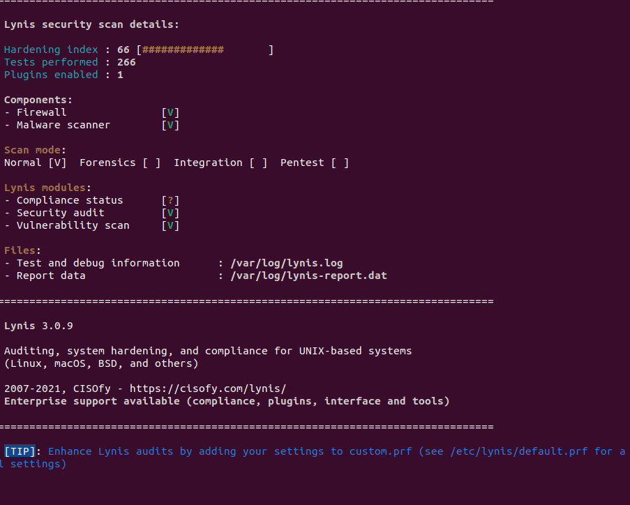
 
---
 
## 2. Configuración SSH – MaxAuthTries
 
Se limitó el número máximo de intentos de autenticación por sesión SSH editando `/etc/ssh/sshd_config`:
 
```bash
MaxAuthTries 3
```
 
Con esto se reduce la ventana de oportunidad para ataques de fuerza bruta sobre SSH. Complementa la protección de Fail2Ban, que se configura en la sección 8.
 

 
---
 
## 3. Configuración SSH – Reenvío TCP y X11
 
Se deshabilitaron funcionalidades de reenvío innecesarias para reducir la superficie de ataque:
 
```bash
AllowTcpForwarding no
X11Forwarding no
```
 
Deshabilitar el reenvío TCP impide usar el servidor SSH como proxy. Deshabilitar X11 impide ejecutar aplicaciones gráficas remotas a través del túnel SSH.
 
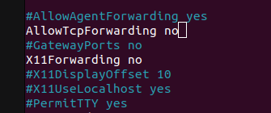
 
---
 
## 4. Configuración SSH – Logging y Autenticación
 
Se habilitó el nivel de log detallado en `/etc/ssh/sshd_config`:
 
```bash
SyslogFacility AUTH
LogLevel VERBOSE
```
 
El nivel `VERBOSE` registra información detallada de cada intento de conexión, incluyendo las claves públicas usadas, lo que facilita detectar intentos de acceso no autorizados.
 
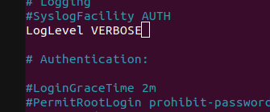
 
---
 
## 5. Política de Contraseñas – Caducidad
 
Se estableció la política de caducidad de contraseñas en `/etc/login.defs`:
 
```bash
PASS_MAX_DAYS   90
PASS_MIN_DAYS   7
PASS_WARN_AGE   7
```
 
| Parámetro | Valor | Descripción |
|---|---|---|
| `PASS_MAX_DAYS` | 90 | Las contraseñas expiran a los 90 días |
| `PASS_MIN_DAYS` | 7 | No se puede cambiar la contraseña antes de 7 días |
| `PASS_WARN_AGE` | 7 | El usuario recibe aviso 7 días antes de la expiración |
 
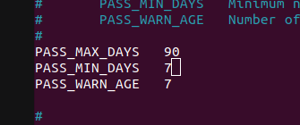
 
---
 
## 6. Política de Contraseñas – SHA Crypt Rounds
 
Se configuró el número de rondas de cifrado en `/etc/login.defs`:
 
```bash
SHA_CRYPT_MIN_ROUNDS 10000
SHA_CRYPT_MAX_ROUNDS 10000
```
 
Aumentar las rondas de hash hace que un ataque de fuerza bruta offline sea mucho más costoso computacionalmente, ya que cada intento requiere más cómputo.
 
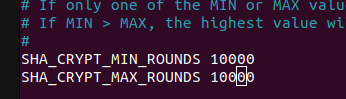
 
---
 
## 7. Parámetros del Kernel – Protección de Red
 
Se añadieron parámetros en `/etc/sysctl.conf` para endurecer la pila de red:
 
```bash
# No aceptar redirecciones ICMP (previene ataques MITM)
net.ipv4.conf.all.accept_redirects = 0
net.ipv4.conf.default.accept_redirects = 0
 
# No enviar redirecciones ICMP (el servidor no es un router)
net.ipv4.conf.all.send_redirects = 0
 
# Registrar paquetes con IPs imposibles (Martian packets)
net.ipv4.conf.all.log_martians = 1
```
 
Para aplicar los cambios sin reiniciar:
 
```bash
sudo sysctl -p
```
 
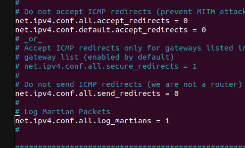
 
---
 
## 8. Configuración de Fail2Ban para SSH
 
Se configuró Fail2Ban para bloquear automáticamente IPs que fallen repetidamente la autenticación SSH:
 
```ini
[sshd]
enabled  = true
port     = ssh
filter   = sshd
logpath  = /var/log/auth.log
maxretry = 3
bantime  = 1h
```
 
Tras **3 intentos fallidos**, la IP queda bloqueada durante **1 hora**. Trabaja en conjunto con `MaxAuthTries` configurado en la sección 2.
 
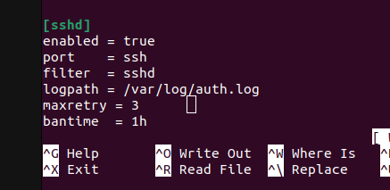
 
---
 
## 9. Instalación de ModSecurity
 
Se instaló el módulo **ModSecurity** para integrarlo con Nginx como WAF (Web Application Firewall). Inspecciona el tráfico HTTP/HTTPS entrante y bloquea peticiones maliciosas antes de que lleguen a la aplicación:
 
```bash
sudo apt update
sudo apt install -y libapache2-mod-security2
```
 
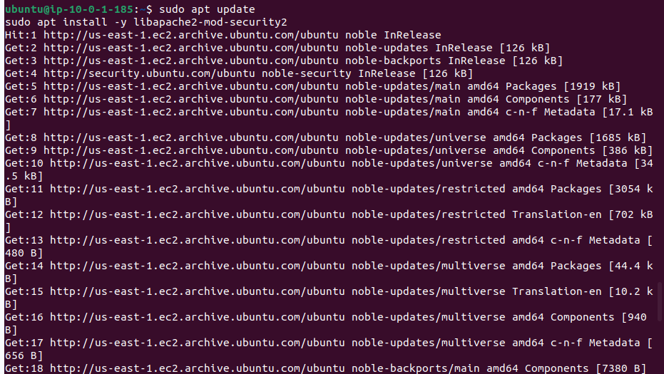
 
---
 
## 10. Activación del Motor de ModSecurity
 
Por defecto ModSecurity viene en modo `DetectionOnly`: detecta ataques pero no los bloquea. Se cambió a modo activo:
 
```bash
# Copiar la configuración recomendada como configuración activa
sudo mv /etc/modsecurity/modsecurity.conf-recommended /etc/modsecurity/modsecurity.conf
 
# Activar el motor de reglas
sudo sed -i 's/SecRuleEngine DetectionOnly/SecRuleEngine On/' /etc/modsecurity/modsecurity.conf
```
 
Sin este paso ModSecurity no bloquea nada, solo registra los ataques en el log.
 
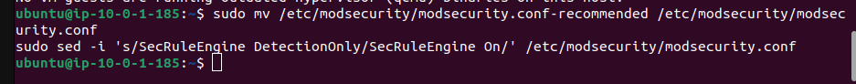
 
---
 
## 11. Reinstalación del CRS de ModSecurity
 
Se reinstalaron las reglas del **OWASP Core Rule Set (CRS)** para asegurar una instalación limpia:
 
```bash
sudo rm -rf /usr/share/modsecurity-crs
sudo apt install -y modsecurity-crs
```
 
La versión instalada fue la `3.3.5-2`. El CRS incluye reglas para detectar SQLi, XSS, LFI, RFI y otros ataques web comunes.
 
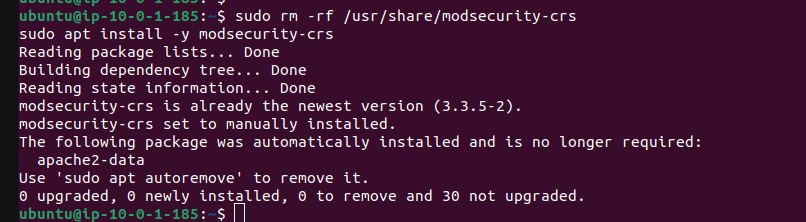
 
---
 
## 12. Configuración de ModSecurity
 
Se editó `/etc/modsecurity/modsecurity.conf` para cargar el CRS de OWASP y una whitelist personalizada:
 
```apache
SecRuleEngine On
SecRequestBodyAccess On
 
# Reglas base de OWASP
Include /usr/share/modsecurity-crs/crs-setup.conf
 
# Reglas de detección de ataques
Include /usr/share/modsecurity-crs/rules/*.conf
 
# Whitelist personalizada (excepciones para evitar falsos positivos)
Include /etc/modsecurity/whitelist.conf
```
 
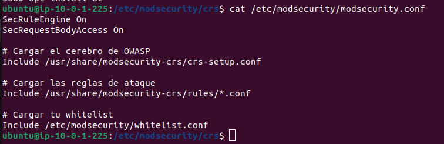
 
---
 
## 13. Validación de Configuración de Nginx
 
Tras integrar ModSecurity en Nginx, se validó que la configuración fuera correcta:
 
```bash
sudo nginx -t
```
 
```
2026/05/04 16:21:44 [notice] ModSecurity-nginx v1.0.3 (rules loaded inline/local/remote: 0/915/0)
nginx: the configuration file /etc/nginx/nginx.conf syntax is ok
nginx: configuration file /etc/nginx/nginx.conf test is successful
```
 
Se confirmaron **915 reglas** cargadas desde el CRS de OWASP y sintaxis de Nginx correcta.
 
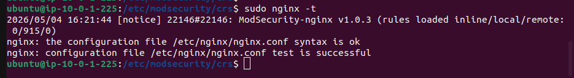
 
---
 
## 14. Prueba de Funcionamiento – Bloqueo de SQLi
 
Con ModSecurity activo, se verificó el bloqueo real lanzando peticiones desde otra máquina (`ip-10-0-1-175`):
 
**Petición con payload SQLi:**
```bash
curl -I -k "https://cyberarena-admin.duckdns.org/?id=1%27%20OR%20%271%27=%271"
# Resultado: HTTP/1.1 403 Forbidden ✅ (bloqueada)
```
 
**Petición legítima:**
```bash
curl -I -k "https://cyberarena-admin.duckdns.org/"
# Resultado: HTTP/1.1 200 OK ✅ (permitida)
```
 
ModSecurity bloquea el ataque y deja pasar el tráfico normal sin afectarlo.
 
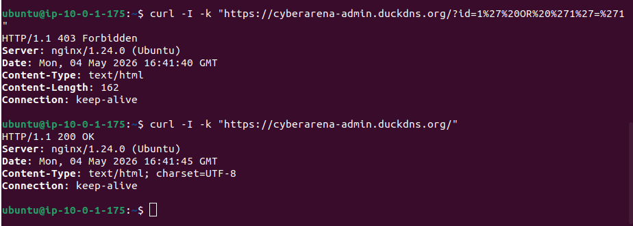
 
---
 
## 15. Configuración del Agente Wazuh
 
Se instaló y configuró el agente **Wazuh HIDS** en `/var/ossec/etc/ossec.conf` para enviar eventos al servidor central:
 
```xml
<ossec_config>
  <client>
    <server>
      <address>10.0.1.96</address>
      <port>1514</port>
      <protocol>tcp</protocol>
    </server>
  </client>
  <config-profile>ubuntu, ubuntu24, ubuntu24.04</config-profile>
  <notify_time>20</notify_time>
</ossec_config>
```
 
El agente envía eventos al servidor Wazuh en la IP interna `10.0.1.96` por el puerto `1514/TCP`.
 
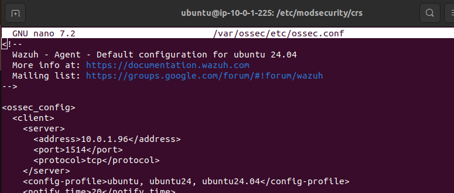
 
---
 
## 16. Securización de MariaDB
 
Se ejecutó `mysql_secure_installation` para eliminar la configuración insegura por defecto de MariaDB:
 
```bash
sudo mysql_secure_installation
```
 
| Opción | Respuesta | Resultado |
|---|---|---|
| Unix socket authentication | Y | Habilitado |
| Cambiar contraseña root | n | Omitido |
| Eliminar usuarios anónimos | Y | ✅ Éxito |
| Deshabilitar login root remoto | Y | ✅ Éxito |
| Eliminar base de datos de prueba | Y | ✅ Éxito |
 
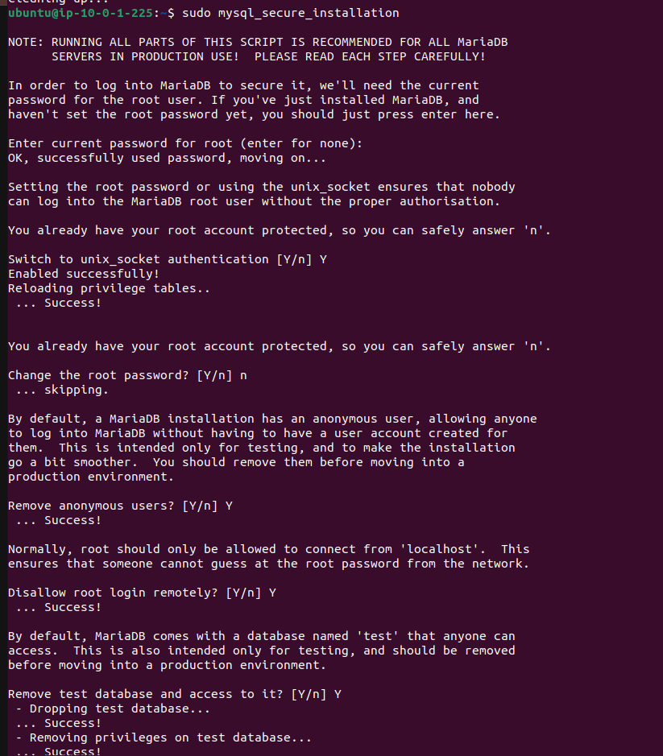
 
---
 
## 17. Auditoría con Lynis – Estado Final
 
Tras aplicar todas las medidas anteriores, se volvió a ejecutar Lynis 3.0.9 para comprobar la mejora. El índice subió de **66 a 73**, con 267 pruebas realizadas y 1 plugin habilitado.

| Métrica | Antes | Después |
|---|---|---|
| Hardening Index | **66** | **73** |
| Tests realizados | 266 | 267 |
 
**Componentes activos detectados por Lynis:**
- Firewall: ✅
- Malware scanner: ✅
**Módulos:**
- Security audit: ✅
- Vulnerability scan: ✅
- Compliance status: ❓ (no configurado)
Los logs se almacenan en `/var/log/lynis.log` y `/var/log/lynis-report.dat`.
 
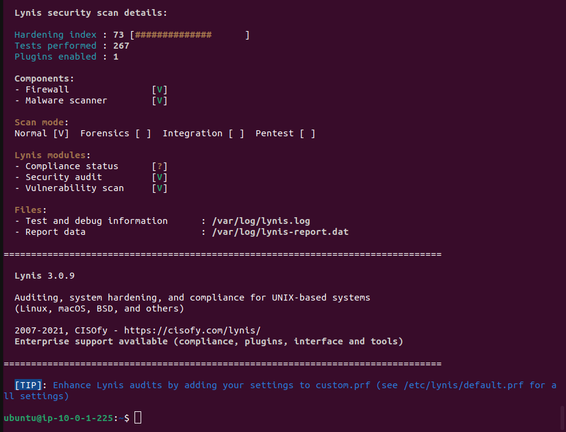
 
---
 
## 18. Logs de ModSecurity – Detección de SQLi (08/05/2026)
 
Nuevo intento de SQLi detectado, esta vez desde la IP `79.117.174.171`:
 
- **Código de respuesta**: 403 (Acceso denegado)
- **Fase de detección**: Phase 2
- **Regla activada**: `REQUEST-942-APPLICATION-ATTACK-SQLI.conf` (ID 942100)
- **Payload detectado**: `?id=1'%20OR%20'1'='1`
- **Severidad**: 2 (OWASP CRS 3.3.5)
- **Fecha/hora**: 2026/05/08 13:46:26
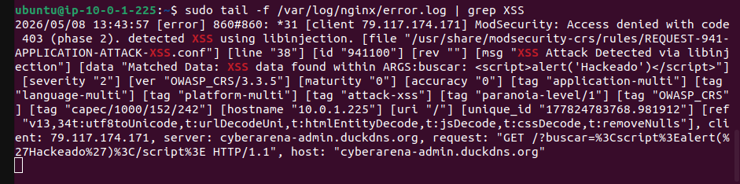
 
---
 
## 19. Logs de ModSecurity – Detección de XSS (08/05/2026)
 
ModSecurity detectó y bloqueó un intento de Cross-Site Scripting desde la misma IP `79.117.174.171`:
 
- **Código de respuesta**: 403 (Acceso denegado)
- **Fase de detección**: Phase 2
- **Regla activada**: `REQUEST-941-APPLICATION-ATTACK-XSS.conf` (ID 941100)
- **Payload detectado**: `?buscar=<script>alert('Hackeado')</script>` (XSS reflejado clásico)
- **Severidad**: 2 (OWASP CRS 3.3.5)
- **Fecha/hora**: 2026/05/08 13:43:57
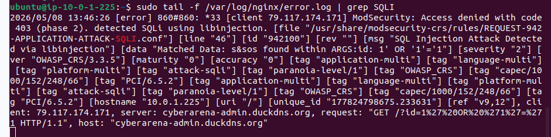
 
---
 
## 20. Script de Backup Automatizado
 
Se creó el script `/usr/local/bin/backup_cyberarena.sh` con las siguientes funciones:
 
- **Backup de base de datos**: mediante `mysqldump` exporta `arena_db` a un archivo `.sql` con fecha.
- **Backup del código web**: comprime `/var/www/html` en un `.tar.gz` con fecha.
- **Limpieza automática**: elimina backups de más de 7 días para no llenar el disco.
Los archivos se almacenan en `/root/backups` con el formato `db_backup_YYYY-MM-DD_HH-MM.sql` y `web_backup_YYYY-MM-DD_HH-MM.tar.gz`.
 
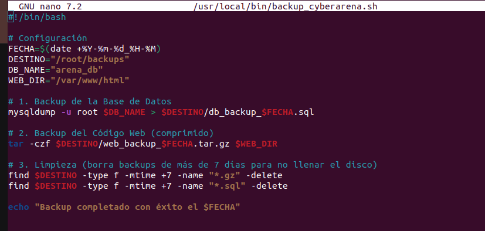
 
---
 
## 21. Configuración de Cron para Backups Automáticos
 
Se programó la ejecución automática del script en `crontab` todos los días a las 03:00 AM:
 
```bash
00 03 * * * /usr/local/bin/backup_cyberarena.sh >> /var/log/backup_cyberarena.log 2>&1
```
 
| Campo | Valor | Descripción |
|---|---|---|
| Minuto | `00` | En el minuto 0 |
| Hora | `03` | A las 03:00 AM |
| Día del mes | `*` | Todos los días |
| Mes | `*` | Todos los meses |
| Día de la semana | `*` | Todos los días de la semana |
 
La salida y los errores se redirigen a `/var/log/backup_cyberarena.log` para poder revisar si algo falla.
 
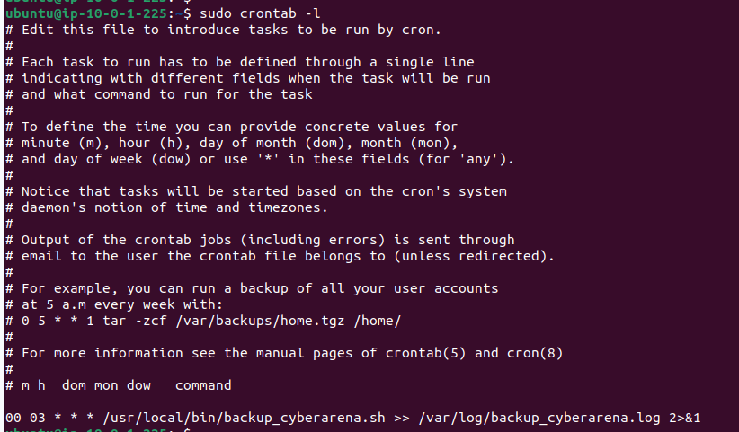
 
---
 
## 22. Ejecución y Verificación del Backup
 
Se ejecutó el script manualmente para comprobar que funcionaba correctamente antes de dejarlo en manos del cron:
 
```bash
sudo /usr/local/bin/backup_cyberarena.sh
```
 
Se listaron los archivos generados en `/root/backups` para confirmar la creación correcta:
 
```bash
sudo ls -lh /root/backups
```
 
```
-rw-r--r-- 1 root root  3.8K May  5 13:48 db_backup_2026-05-05_13-48.sql
-rw-r--r-- 1 root root   14K May  5 13:48 web_backup_2026-05-05_13-48.tar.gz
```
 
| Archivo | Descripción |
|---|---|
| `db_backup_*.sql` | Backup de la base de datos MariaDB |
| `web_backup_*.tar.gz` | Backup comprimido del directorio web |
 
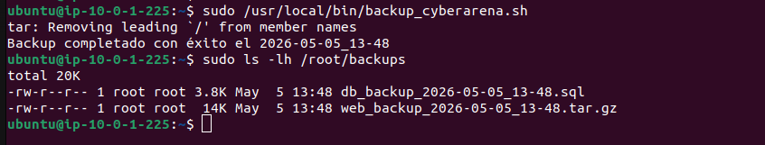
 
---
 
## Resumen del Proceso
 
| Capa | Medida | Estado |
|---|---|---|
| **Red** | Parámetros kernel anti-MITM y anti-redirect | ✅ |
| **SSH** | MaxAuthTries, LogLevel VERBOSE, sin forwarding | ✅ |
| **Autenticación** | Fail2Ban (3 intentos / 1h ban) | ✅ |
| **Contraseñas** | SHA rounds 10000, caducidad 90 días | ✅ |
| **Base de datos** | MariaDB securizado, sin usuarios anónimos | ✅ |
| **WAF** | ModSecurity + OWASP CRS 3.3.5 en modo bloqueo | ✅ |
| **HIDS** | Agente Wazuh conectado al servidor central | ✅ |
| **Backups** | Script automatizado con limpieza de 7 días | ✅ |
| **Auditoría** | Lynis: índice mejorado de 66 → 73 | ✅ |
 
---
 
## Incidencias y Problemas Encontrados
 
### Incompatibilidad de ModSecurity con Nginx
 
La incidencia más significativa de este sprint fue la integración de **ModSecurity con Nginx**. ModSecurity fue diseñado originalmente como módulo nativo de **Apache**, donde se instala directamente como `mod_security2` y se carga sin fricción desde la propia configuración del servidor. Sin embargo, el servidor web del proyecto utiliza **Nginx**, y la integración en este caso no es directa.
 
**Causa del problema:**
 
El paquete `libapache2-mod-security2` que se instala desde los repositorios oficiales de Ubuntu es la versión compilada para Apache. Nginx no tiene soporte nativo para cargar módulos de Apache, por lo que intentar enlazar ModSecurity directamente con Nginx de esta forma no funciona. La integración requiere usar un conector específico: **`ngx_http_modsecurity_module`**, que actúa como puente entre el motor de ModSecurity y Nginx.
 
El problema se manifestó con errores al intentar cargar las directivas de ModSecurity desde la configuración de Nginx, ya que este no reconocía los bloques de configuración propios de ModSecurity al no tener el módulo conector cargado.
 
**Solución implementada:**
 
Se compiló e instaló el módulo conector oficial `ModSecurity-nginx` (`ngx_http_modsecurity_module`), que permite a Nginx comunicarse con la librería `libmodsecurity3` (la versión 3 del motor, independiente de Apache). El proceso seguido fue:
 
1. Instalar las dependencias de compilación y la librería `libmodsecurity3`:
```bash
sudo apt install -y libmodsecurity3 libmodsecurity-dev
```
 
2. Descargar y compilar el conector `ModSecurity-nginx`:
```bash
git clone --depth 1 https://github.com/SpiderLabs/ModSecurity-nginx.git
```
 
3. Recompilar Nginx incluyendo el módulo dinámico:
```bash
./configure --with-compat --add-dynamic-module=../ModSecurity-nginx
make modules
sudo cp objs/ngx_http_modsecurity_module.so /etc/nginx/modules/
```
 
4. Cargar el módulo en la configuración principal de Nginx (`/etc/nginx/nginx.conf`):
```nginx
load_module modules/ngx_http_modsecurity_module.so;
```
 
5. Habilitar ModSecurity dentro del bloque `server` del virtual host:
```nginx
modsecurity on;
modsecurity_rules_file /etc/modsecurity/modsecurity.conf;
```
 
Una vez aplicada esta solución, Nginx cargó correctamente el motor de ModSecurity junto con las 915 reglas del OWASP CRS, tal y como se muestra en la sección 13 de esta documentación.

